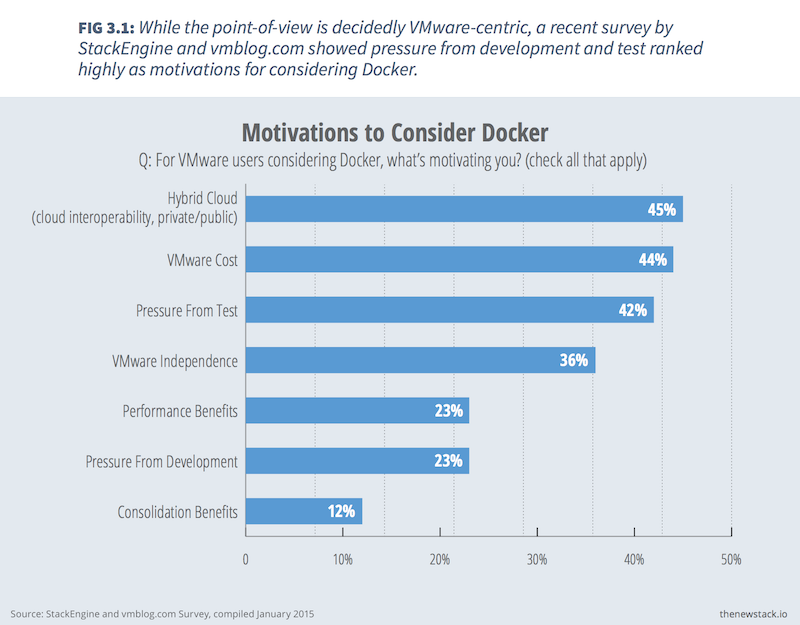
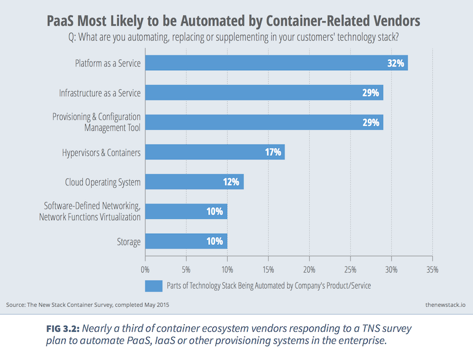

# Adopting Containers in the Enterprise
by Vivek Juneja

---

Disruptive new technologies and practices often follow an exhaustive adoption process in large enterprises. The process typically begins with elaborate presentations and discussions, followed by various proofs-of-concept. When adoption does occur, it typically occurs first within small teams building non-critical systems, and mostly for development and test workloads. By the time the technology reaches production, a significant amount of time and opportunity has passed.

Containers, and the notion of containerizing enterprise workloads, are going through this process right now, in a great many enterprises, fueled by the promise that containers offer to address the varied issues that plague developer productivity and application delivery in the enterprise.

## Enterprise Motivations

By providing abstraction around the workload, and making it portable, containers become the foundation for supporting a variety of more efficient development processes and application architectures.

Specifically, enterprise development teams and IT organizations see in Docker and containers a means of addressing:

1. Process inefficiencies: Different teams within the enterprise often have their own standards for developing and releasing software. Outsourced development, unfortunately often accompanied by limited governance and transparency, often exacerbates this problem. Many enterprises are exploring containers as a way to standardize the software release process across teams.

1. Legacy applications: Legacy applications and systems are commonplace in the enterprise. These systems create constant operational and maintenance issues. Project teams struggle to allocate resources to operate on-demand test infrastructure, and as a result frequently forgo testing in favor of releasing new functionality on time. Teams working on legacy applications are attracted to containers for their ability to help make more efficient use of infrastructure.

1. Collaboration: Development teams working on large projects have to coordinate software releases, a process that often takes a long time. Teams working on continuously maintained and developed legacy applications, for example, appreciate the ability of containers to help them synchronize software releases more easily.

A development approach based on container images also helps encourage closer interaction between the development and operations teams, thereby encouraging DevOps.

1. Dev/prod parity: Production, development and test environments often have parity issues, drifting apart in ways that lead to constant “runs-on-my-machine” issues. Containers help ensure a consistent runtime environment across various infrastructures, a feature enterprise development teams find extremely useful.

1. VM sprawl: As enterprises adopt virtual machines, VM sprawl often sets in, leading to less efficient utilization of the infrastructure. Enterprises often respond by establishing strict governance rules, like approvals and workflows, to limit the sprawl. These rules, however, reverse the benefits of elasticity and self-service for developers. Because the overhead associated with containers is so much lower than that of VMs, many enterprises are excited about containers as a way to mitigate sprawl.

1. Cloud-native applications: Microservices and other cloud-native application architectures require a different view of infrastructure than is traditionally assumed. In containers, enterprise development teams see an opportunity to more easily build cloud-native applications and take advantage of emerging trends.

## Container Adoption Strategies

When virtual machines started getting popular inside the enterprise, a major selling point to the IT department was the opportunity to consolidate underutilized infrastructure to reduce its operational footprint and cost. Adoption of containers and the ecosystem surrounding them, however, is being driven by agility, not cost reduction.

There are a handful of strategies that enterprises commonly take when evaluating and adopting container technologies:

1. Go after low-hanging fruit: When development teams have to struggle to get test environments provisioned and operational, they lose a lot of time, and frustration mounts. Solving infrastructure availability crunches in development and testing is often a good driver for making the leap to containers.

   For projects that don’t require dedicated instances, reusing IT infrastructure for test environments deployed as linked containers is a great way to get started, and can provide important operational knowledge of the technology.

1. Update build and deploy processes: Build and deployment infrastructure needs to be modified for the enterprise to take full advantage of modern infrastructure. To deploy to public and private clouds, some enterprises deploy the end application as a set of machine images, reducing the time required to set up newly provisioned on-demand infrastructure. The same practice can be extended to container images.

   In a container-based deployment model, the build step can generate the new container image using a pre-existing base image for the environment. The deployment step can take this image and run it on any infrastructure supporting the chosen container technology.

1. Go “container first”: Adopting a container first approach for all new projects is another common way to drive adoption. This means that all new projects must build and release software with containers, unless there are specific reasons why they cannot.

   Going container first encourages development teams to consider containers a first-class element of their application topology and spurs the development of container-native applications. In addition, ramping up new development teams with pre-containerized project environments is far easier than with traditional approaches. This helps get teams started quickly, without the complexity of transitioning existing project processes.
   
1. Standardize base images: It’s important for operations teams to formalize and release standard container images that all projects can use. These customized base images can be hosted on a private registry used by development teams when building projects. Changes to the standardized base images could mean new releases on the registry, which can then be transparently used in the development process. Enterprises are accustomed to hosting private repositories for firewall rules and other digital IT assets, so this should not be a strange adoption step for them.

## Key Issues Faced

Enterprises face two key challenges when incorporating containers into their overall IT strategy: [security and a lack of mature tools](http://www.theregister.co.uk/2015/01/12/docker_security_immature_but_not_scary_says_gartner/).

While web-scale companies like Google and Twitter have been using containers in production for years, it’s still early days for both open source and proprietary products. The issue of tool maturity is largely one of time and experience. With more adoption and demand, the tools will inevitably stabilize and improve.

>Enterprise IT organizations are looking to containers to help them achieve more modern application architectures and development processes, in the process allowing them to innovate more quickly. 

Security, on the other hand, has been a dominant focus among early adopters. While a concern for all firms using containers in production, it is an even greater worry for companies using containers with production workloads in multi-tenant environments.

The issue at hand is one of container isolation. To date, containers don’t exhibit the strong and tested ability to isolate disparate workloads that has become assumed of the various virtual machine hypervisors.

Last year, Canonical introduced [LXD](http://www.ubuntu.com/cloud/tools/lxd), which implements ideas around stronger container security and makes them available via Ubuntu and OpenStack integration. New Projects like [Hyper](https://hyper.sh/) — which uses a minimalist Linux kernel, called a HyperKernel, to load and run containers — are also emerging as interesting alternatives to containers alone. And VMware has been promoting traditional virtualization [as a complement to containers ](http://blogs.vmware.com/cto/vmware-containers-containers-without-compromise/)for this very reason.

## Containers in Practice

As organizations continue to drive agility and innovation, they naturally aim to eliminate inefficiencies, such as resource constraints and process bottlenecks. At the same time, they are turning to modern application  architecture styles like microservices, and development processes like continuous delivery, which together allow developers to iterate much more quickly.

Last year, the chief architect of [ING spoke at Dockercon Europe ](https://blog.docker.com/2014/12/dockercon-europe-keynote-continuous-delivery-in-the-enterprise-by-henk-kolk-ing/)about how they are using Docker to enable continuous delivery. [BBC News also highlighted](https://blog.docker.com/2014/12/dockercon-eu-enterprise-ci-problems-and-our-solutions-by-simon-thulbourne/) how it architected its continuous integration solution around Docker, and shared the caveats and compromises that they had to deal with in doing so. The presentations by these two large companies is a sign of how quickly the enterprise is getting serious about container technologies.

By taking one or more of the approaches outlined in this article, enterprises new to the container game can take their first steps down the path of enlightenment, knowing that they’re following a trail that has been trod many times before.

---
Copyright &copy; 2015, The New Stack. All rights reserved.