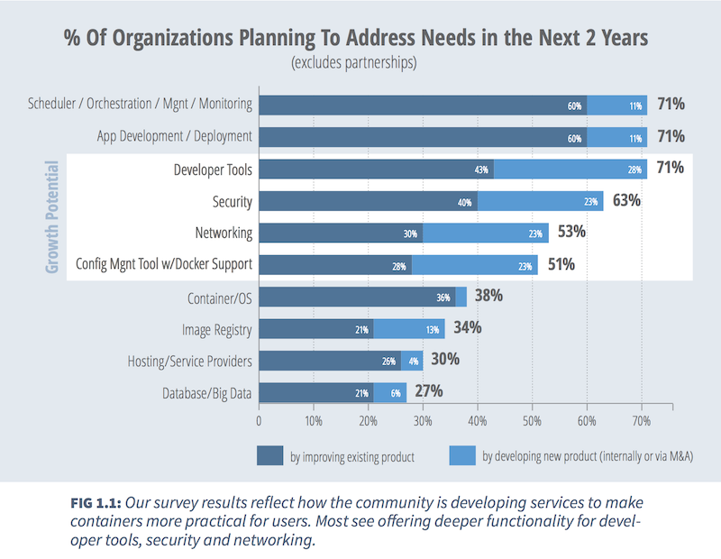

# Crossing the Ocean With Containers
By Jeff Sussna

---
  
When cloud computing first made its appearance, most people viewed it as a cost-reduction convenience. Soon, though, many organizations began to recognize its power to transform IT on a deeper level. Cloud offered a vision of infrastructure as a dynamic, adaptable resource that IT could use to power 21st-century business imperatives for agility and responsiveness. Terms such as “cloud-native” and “[cattle not pets](http://thenewstack.io/pets-and-cattle-symbolize-servers-so-what-does-that-make-containers-chickens/)” expressed the understanding that cloud-based IT required a fundamental mindset shift, away from treating infrastructure components as large, expensive, specialized, handcrafted, and slow-to-change.

>  Docker has captured the industry’s imagination with breathtaking speed.

Containers are taking this transformation to the next level. Docker has captured the industry’s imagination with breathtaking speed. It began in similar fashion to cloud, seeming to provide a more convenient solution to existing packaging and deployment problems. In reality, though, containers point the way towards an even more profound mindset shift than cloud. 

While cloud computing changed how we manage “machines,” it didn’t change the basic things we managed. Containers, on the other hand, promise a world that transcends our attachment to traditional servers and operating systems altogether. They truly shift the emphasis to applications and application components. One might claim that containers, in combination with the microservices software pattern, represent the fruition of the object-oriented, component-based vision for application architecture. 

In a testament to the rapidity of Docker’s ascent, the conversation has quickly shifted to its readiness for production enterprise use. Blog posts chronicling experiences running [Docker in production](http://thenewstack.io/now-in-beta-rancher-labs-runs-docker-natively-in-production/) duel with others detailing [the ways in which it’s not yet viable](http://thenewstack.io/docker-production-environment-four-recent-examples-two-thumbs-no-go/). This binary argument misses the nature of technology adoption. The fact that a craft has proven itself seaworthy doesn’t obviate the need to figure out how to navigate the ocean with it. Just as was the case with cloud computing, containers pose as many questions as they answer. These questions arise on multiple levels: architectural, operational, organizational, and conceptual.

Containers make many things possible, without necessarily accomplishing any of them by themselves. Almost immediately after the excitement of recognizing the power of containers, one begins the more laborious process of figuring out how to use them for practical purposes. Immediate issues include questions such as:

* How do containers communicate across operating system and network boundaries? 

* What’s the best way to configure them and manage their lifecycles? 

* How do you monitor them? 

* How do you actually compose them into larger systems, and how do you manage those composite systems?

Various answers to these questions have begun to emerge. Packaging tools such as Packer bridge configuration automation with immutable infrastructure. Cluster management systems such as Kubernetes layer replication, health maintenance, and network management on top of raw containers. Platform-as-a-Service offerings such as Cloud Foundry and OpenShift are embracing containers within their own architectural models. 

These higher-order systems answer some of the initial questions that arise while trying to deploy containers. They also, though, raise new questions of their own. Now, instead of asking how to manage and compose containers, one has to ask how to manage and compose the container management, deployment, and operations toolchain.

This process is a recursive one. At the moment, we can’t know where it will end. What does it mean, for example, to run [Kubernetes on top of Mesos](http://thenewstack.io/mesosphere-now-includes-kubernetes-for-managing-clustered-containers/)? Contemplating that question involves understanding and interrelating no less than three unfamiliar technologies and operating models. 

More importantly, though, organizations are just beginning to contemplate how to integrate the container model into their enterprise architectures, organizations, and conceptual frameworks. This process will be a journey of its own. It will consist of a combination of adaptation and transformation. The precise path and destination of that journey are both unknown, and will depend to a large degree on each organization’s individual history, capabilities, and style.

>Deep technical change is a complex process. It can’t be predicted or linearly planned. 

Implementing it requires the same lean and agile techniques we use for product development. The question, “is Docker ready for the enterprise?” is the wrong question. A better question would be, “how are containers likely to perturb our organization and our ways of doing things?” Answering that question requires conducting experiments and learning from feedback. It also goes far beyond purely technical concerns. 

Adopting a transformative technology such as cloud or containers impacts every aspect of IT. When computing resources pop into and out of existence by the minute instead of the year, and in the hundreds of thousands instead of the hundreds, traditional management methods no longer suffice. Both the configuration management system and the configuration and change management processes need retooling.

New tools and processes, however, are necessary but not sufficient. Technical staff don’t just need retraining to use the new tools; they also need to learn new ways of thinking about what systems are and how to solve problems with them. Making Docker enterprise-ready involves not just making it technically robust and secure, but also figuring out what it implies for staffing, hiring, and training. The constraint that gates a company’s ability to absorb change often isn’t a new technology itself, but rather the ability to hire people who can comprehend the implications of that technology, and who can operate it based on that understanding.

Ultimately, the impact of containers will reach even beyond IT, and play a part in transforming the entire nature of the enterprise. The value of microservices and containers lies in how they enable smaller, faster, more frequent change. In order to take full advantage of this capability, IT organizations will need to restructure themselves socially as well as architecturally. This cascading transformation process will in turn apply to the enterprise as a whole, as it strives to take advantage of its new capabilities for responsive digital service.

Just as container management systems present new sets of questions, so too do new organizational structures. If a company decides to adopt Holacracy as part of its mission to improve agility, it will have to navigate that adoption process. Just as with technological change, effective social and structural change happens through experimentation, failure, and adaptation.

In thinking about enterprise adoption of Docker or any other container technology, we need to understand it for what it is: a trigger for a much larger, more complex, and long-lasting process. We need to cast our gaze beyond containers themselves, towards the socio-technical systems they are just beginning to perturb. 

>We need to apply everything we’ve learned about navigating change and uncertainty, and step beyond the binary success/failure conceptual model of adoption. 

In this way, containers are no different from DevOps, or Lean, or any other organizational transformation.

---
Copyright &copy; 2015, The New Stack. All rights reserved.