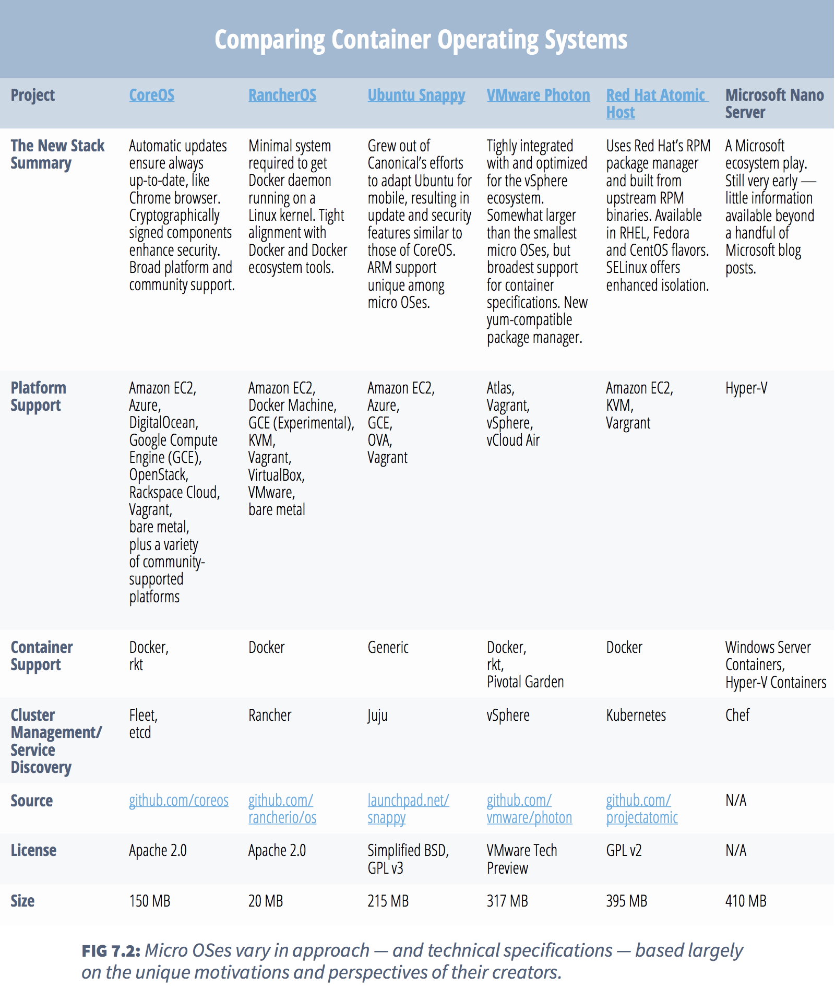

# Docker Fuels A Rethinking of the Operating System
by Susan Hall and Sam Charrington

Since the launch of Docker, there’s been an explosion of new container-centric operating systems, including [CoreOS](https://coreos.com/), Ubuntu [Snappy](http://developer.ubuntu.com/en/snappy/), [RancherOS](http://rancher.com/rancher-os/), Red Hat’s [Atomic Host](http://www.redhat.com/en/about/press-releases/red-hat-launches-red-hat-enterprise-linux-7-atomic-host-advances-linux-containers-enterprise), VMware’s recently announced [Photon,](http://blogs.vmware.com/cloudnative/introducing-photon/) and Microsoft’s [Nano Server](https://msdn.microsoft.com/en-us/library/mt126167.aspx).
  
Of course, you can run Linux Containers (LXC) on any Linux distribution, and most other major operating systems now have some sort of comparable technology. But what sets these new container-centric operating systems apart is that they are much lighter weight than a traditional Linux distribution.
  
“These traditional Linux distros have just gobs and gobs of packages,” said Kit Colbert, VMware’s vice president and CTO of Cloud-Native Apps. “They’ve got 4, 6 GB of stuff in there — the application can’t see any of that. With a Java app, you’ve got to have a JRE [Java Runtime Environment] inside the container for that app to run. It doesn’t need anything outside the container to run. So why do you have 4 or 6 GB of stuff that you just don’t need anymore?”

At the same time, the containers have to run somewhere, and that host runs on an operating system as well. Hence the rise of these new container-centric “micro OSes.”
  
The idea of a minimalist operating system isn’t new. Stripped-down operating systems have long been embedded in electronic systems, ranging from traffic lights to digital video recordings. And minimal operating systems, often based on Linux, that can boot from a CD or even floppy disks, have been around since the 1990s. But these operating systems were typically designed to run only a single node. 
  
>Today’s micro OSes are designed for a world in which, thanks to containers, the entire data center is treated as one giant operating system that spans hundreds or even thousands of nodes.
  
This is leading to new thinking about operating systems. In this chapter we take a look at the major players and their vision for the future of the operating system.

## CoreOS
Rivals give props to CoreOS for pioneering the micro OS even before Docker came on the scene. The company recently [added $12 million](http://thenewstack.io/coreos-tightens-fit-with-kubernetes-raises-12m-from-google-ventures/) to its coffers with investment from Google Ventures, and unveiled a technology called [Tectonic](http://tectonic.com/blog), combining its CoreOS portfolio and Kubernetes — Google’s open source project for managing containerized applications.
  
“The container OS is about building the ideal environment for running your application when it’s OK to change things,” said CoreOS CEO Alex Polvi. “In the traditional Linux server environment, it’s hard to change things because applications are just so fragile.”

With CoreOS, the operating system is treated more like a web browser, such as Chrome, that is automatically updated as new components are released. Cryptographic signatures help ensure the validity of updates and the integrity of the system as a whole.
  
While other lean OSes are aimed at a particular flavor of technology, CoreOS aims to be the general-purpose choice. The company officially supports numerous deployment options, and many more community-supported options are available.
  
“One of the things we’ve figured out is how to build the OS and run it in all these different environments,” Polvi said. “We’re very focused on building CoreOS for production-ready environments and it feels like all these other [new OSes] are a long way off from that.”

## RancherOS
  
RancherOS, consisting of just the kernel and Docker itself, is one of the smallest micro OSes, weighing in at around 22 MB, co-founder and CEO Sheng Liang said, compared to about 300 MB for VMware’s Photon.
  
While RancherOS also grew out of frustrations similar to those experienced by CoreOS, the company took a different approach in developing its operating system, said Liang. To develop its Docker-optimized micro OS, the company sought to build the minimal technology required to run the Docker daemon on a Linux kernel. To achieve this, it first decided to eliminate systemd, the service-management system built into most Linux distributions, and rather use Docker itself to boot the system.

Liang said that systemd is often in direct conflict with Docker. Since containers are often created outside of systemd’s view, it often tries to kill them, but winds up only killing the client while the container keeps running. He said that RancherOS worked on finding a way to bridge the camps behind the two technologies for a long time, but is no longer sure there’s any way to solve the problem.
  
“The way the industry’s going right now, both the systemd and Docker communities are on a bit of a collision course,” Liang said. “Both see themselves as the ever-expanding center of the universe, and it’s hard [for either] to listen to another master.”

## Ubuntu Snappy
Canonical boasts that Ubuntu is the most popular Linux distro for containers, with over seven times more Docker containers running on Ubuntu than any other OS.

Snappy is “a very tiny, thin operating system,” said Dustin Kirkland, Ubuntu Cloud Solutions product manager and strategist at Canonical. Snappy Ubuntu Core is the result of applying lessons that Canonical learned in its efforts to create a tiny-yet-robust operating system for mobile devices. To support carriers’ and users’ needs for reliable system and application updates, the company developed the Snappy technology, which uses “transactional, image-based delta updates” for the system and applications, transmitting only differences to keep downloads small and ensure that upgrades can always be rolled back.
  
To enhance the security of mobile devices, Canonical created a containment mechanism that isolates each application running on the device. Canonical contends that this same capability offers a level of isolation beyond that available using Docker alone, but few details are available.
  
In addition to Snappy, Canonical  has unveiled a second element of its vision for a containerized world in [LXD, a lightweight hypervisor](http://thenewstack.io/latest-ubuntu-adds-lxd-0-7-hypervisor-rendering-desktops-an-endangered-species/) based on LXC, the same Linux feature that made Docker possible. Originally designed as a mechanism to incorporate LXC-based containers into OpenStack clouds, the launch of LXD caused some to ask whether Ubuntu intends to replace Docker with the technology.
  
According to Kirkland, however, Docker and LXD are complementary technologies. He adds that Canonical continues to recommend Docker for packaging and running applications. But outsiders aren’t necessarily convinced.
  
Canonical’s real motivation is control of the entire stack, said Janakiram MSV, principal analyst at Janakiram & Associates. “Snappy will be their CoreOS, and LXD will become an alternate native hypervisor,” he said. “Then they have more VM-like containers. They also have Juju Charms with its own orchestration and provisioning story for the lifecycle of containers.”

## VMware Photon
The meteoric rise of Docker, itself essentially a virtualization technology, has caused many to anticipate the VMware response, even, if not especially, after the two companies [announced a partnership ](http://thenewstack.io/amid-container-vs-vm-hype-vmware-draws-docker-closer/)back in August of last year. Its first response finally came earlier this year, with the announcement of its lightweight OS Photon.
  
The changing relationship between applications and infrastructure is of key importance to VMware, said Colbert. “When you look at that split, what used to be an operating system used to have some app stuff and some infrastructure stuff,” he said. “Now the app stuff is inside the container; the infrastructure is outside of there. Photon is kind of the infrastructure portion of the Linux OS. That’s why we want to build that into [its hypervisor] ESX.”
  
CoreOS will support Photon. Photon is really targeted to the VMware product line, according to CoreOS’s Polvi. “To run a container in a server environment, you need Linux, which means VMware now needs to manage above the hypervisor, actually into a Linux OS,” he said. “This does not mean that VMware does not allow you to run CoreOS or Red Hat or any other operating system. It means they need a specialized one to add containers to VMware’s product. They needed an extension of their hypervisor into an operating system.”

Janakiram sees [VMware as being forced to bring out its own OS](http://www.forbes.com/sites/janakirammsv/2015/04/24/containers-and-microservices-force-vmware-to-ship-a-linux-distribution/) out of fear that the shift from hypervisors to containers will erode their existing business. 
  
>“VMware also knows there’s more money to be made in the management layer of containers. They want to repeat the magic of the v-family of products with containers.  

## Red Hat Atomic Host
Red Hat launched RHEL 7 Atomic Host in March. It has [fewer than 200 binaries](http://www.theplatform.net/2015/04/14/thin-is-in-for-operating-systems-thanks-to-docker/), compared to the 6,500 in the full RHEL 7 release.
  
Mark Coggin, senior director of product marketing for Red Hat Enterprise Linux, called it a “happy medium” in the world of lean OSes: lighter than a traditional OS, but not as small as some of its competitors. He cautions against more “extreme” approaches, such as that of RancherOS, saying that it could lead to more complexity, because it requires running additional system containers in addition to the application container.
  
“We’ve said, ‘We think these are the core system services that need to be in the host platform that will address 80 to 90 percent of use cases for container applications,’” he said. “If a customer needs something beyond that — like system activity data collection, sys logging, identity — we have containerized versions of those as well, but we put much of what we think is necessary in the host platform.”
  
He said Atomic Host brings to the table a base derived from an enterprise-grade operating system rigorously tested by Red Hat’s engineering team. According to Red Hat, this is important because there are cross-dependencies that might not be readily apparent, say between the version of the Dynamic Host Configuration Protocol (DHCP) console or the version of Secure Shell (SSH) that you need inside your container, and the kernel.
  
“We’ve already gone through the work of ensuring that the version of SSH or DHCP that you’re using is going to work with the version inside RHEL Atomic Host,” Coggin said.
  
Red Hat is also working with independent software vendors (ISVs) to certify that the containers they build are based on images that are known, tested and safe.

## Microsoft Nano Server
  
Nano Server, Microsoft’s lightweight OS, [targets two use cases](http://thenewstack.io/microsofts-lightweight-os-and-its-deep-linux-connection/), according to The New Stack’s Scott M. Fulton III. The first is focused on supporting cloud infrastructure, such as clustered hypervisors and clustered storage. The second focuses on supporting cloud-native applications. In this latter role, Nano Server will be suited to a new class of apps that get developed and deployed on Azure within a new Azure-based development environment — outside of the conventional client-based Visual Studio.

It’s these new apps which will serve as Windows developers’ entryway to the world of containers. 

Developers writing for Nano Server will be guaranteed compatibility with pre-existing Windows Server installations, because Nano Server is effectively a subset of Windows Server. There may be a significant adjustment period, however, until developers become accustomed to the concept of microservices. Windows developers are used to having large libraries of pre-existing functionality available to their code in a global scope. Apps written to Nano Server run on a physical host, a virtual host or in a container. Two [types of containers](http://thenewstack.io/docker-for-windows-is-on-its-way/) work on both Windows Server and Nano Server: the same Docker containers developed for Linux, and a type developed by Microsoft for its own hypervisor platform, called Hyper-V Containers.

“These provide additional isolation,” [explained Jeffrey Snover](http://thenewstack.io/microsofts-lightweight-os-and-its-deep-linux-connection/), Microsoft distinguished engineer and lead architect, in The New Stack. “They’re really used for things like multi-tenant services, or multi-tenant platform-as-a-service, where you’re going to be running code that might be malicious that you don’t trust.” 

The concept draws inspiration from Drawbridge, a containerization system developed by Microsoft Research, mainly for purposes of process isolation and sandboxing untrusted apps that could crash the system.

## The Swirling Market
  
It’s not surprising to see so many vendors jockeying for position. Two camps are forming, Janakiram said: Red Hat, Docker and their allies on one side; and VMware, CoreOS and their allies on the other. “The more Red Hat goes closer to Docker, VMware will go farther.” 
  
Google, he said, is on the fence. “Google is smiling because they know how to do containers very well,” he said. 
  
“Kubernetes will work with rkt and they’re working to make it work with any other container. But they want to make money on the public cloud; they want to run containers on the Google cloud. But they don’t mind giving away some of their innovation on orchestration.”
  
Microsoft, while closely aligned with Docker, has an uphill battle ahead of it as it works to overcome incompatibilities between Windows and Linux. “In 24 months the dust will settle, and we’ll get to see who’s the winner,” Janakiram said. “Who’s still relevant in the market.”
