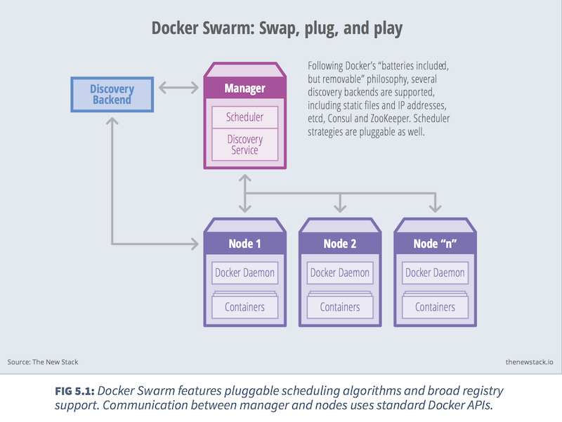
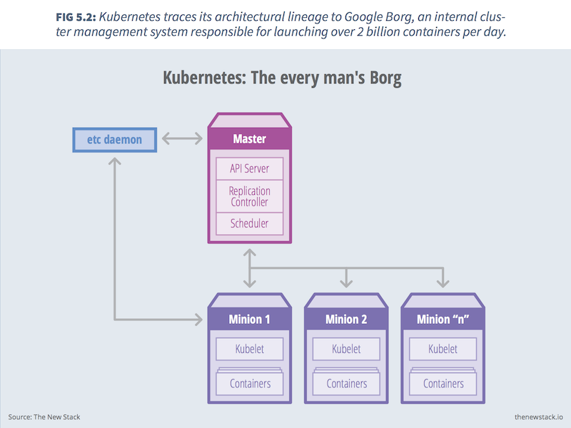
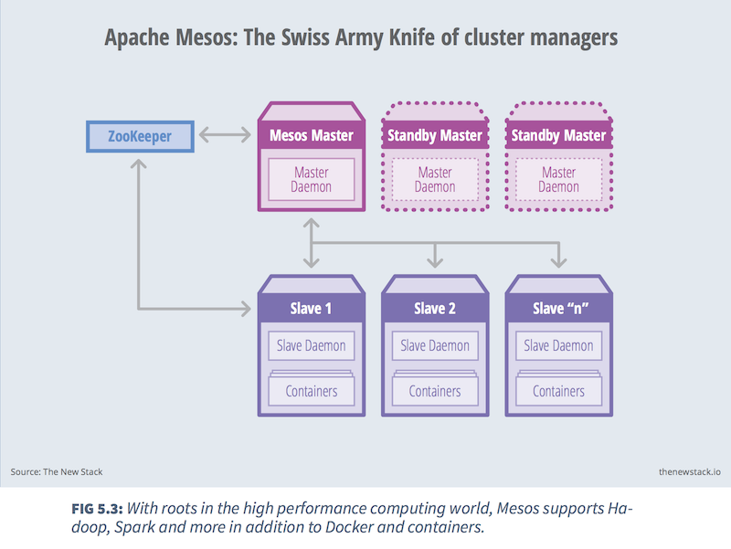
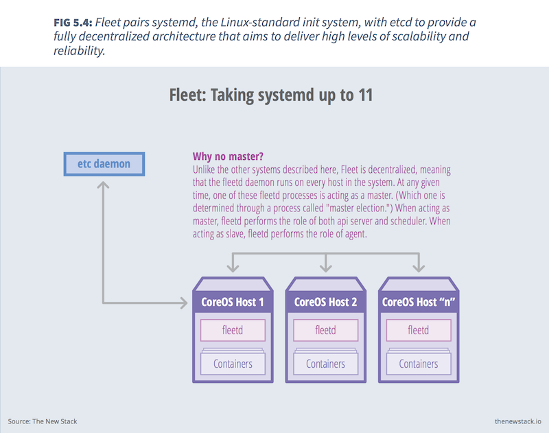
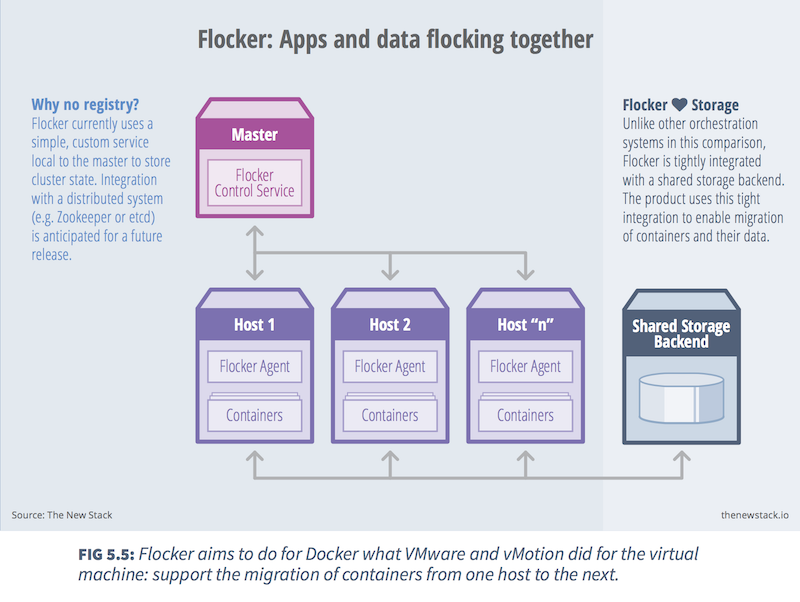
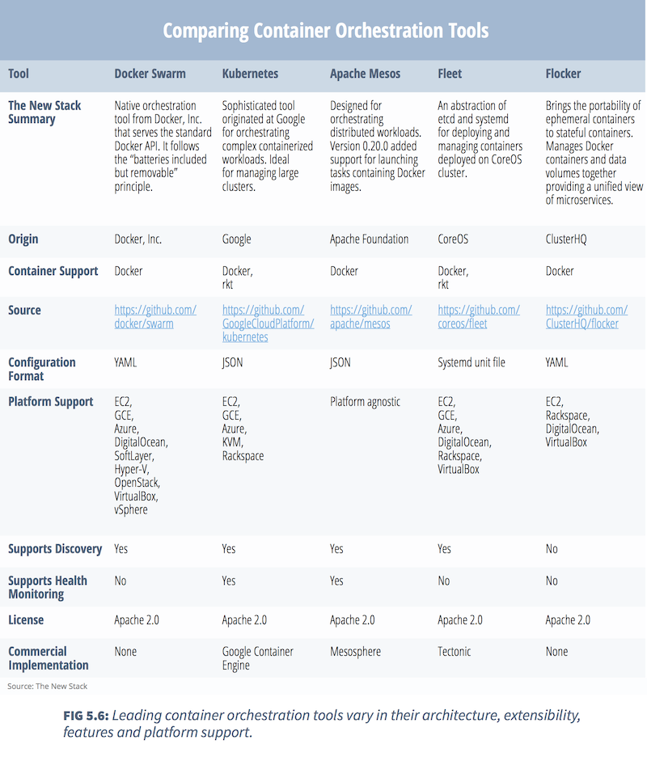

# Docker Orchestration Tools
By Janakiram MS

---

The Docker platform contains many tools to manage the lifecycle of a container. Docker Command Line Interface, for example, supports the following container activities

* Pulling a repository from the registry.
* Running the container and optionally attaching a terminal to it.
* Committing the container to a new image.
* Uploading the image to the registry.
* Terminating a running container.

While the CLI meets the needs of managing one container on one host, it falls short when it comes to managing multiple containers deployed on multiple hosts. To go beyond the management of individual containers, we must turn to orchestration tools.

>Orchestration tools extend lifecycle management capabilities to complex, multi-container workloads deployed on a cluster of machines.

By abstracting the host infrastructure, orchestration tools allow users to treat the entire cluster as a single deployment target.

## Baseline Features
The process of orchestration typically consists of scheduling, cluster management and health monitoring functions. A handful of core features have come to characterize user expectations for modern container orchestration tools.

### Declarative Configuration
Orchestration tools provide an option for DevOps teams to declare the configuration in a standard format, such as YAML or JSON. These definitions carry crucial information about the repositories, tags, ports, volumes and logs supporting the workload. The tools are idempotent with respect to the system configuration, which means that applying the same configuration multiple times will always have the same result.

### Rules and Constraints
Workloads often have special requirements for host placement. For example, it’s pointless to provision the master and slave database container on the same host; it defeats the purpose. Similarly, it may be a good idea to place in-memory cache on the same host as the web server. Orchestration tools support mechanisms for defining the affinity and constraints of container placement.

### Provisioning
Provisioning, or scheduling, deals with negotiating the placement of containers within the cluster and launching them. This process involves selecting an appropriate host based on the configuration and the rules and constraints that it defines. Apart from a container-provisioning API, orchestration tools will invoke the infrastructure APIs specific to the host environment.

### Discovery
In a distributed deployment consisting of containers running on multiple hosts, container discovery becomes critical. Web servers need to dynamically discover the database servers, and load balancers need to discover and register web servers. Orchestration tools provide, or expect, a distributed key-value store, a lightweight DNS or some other mechanism to enable the discovery of containers.

### Health Monitoring
Since orchestration tools are aware of the desired configuration of the system, they are uniquely able to track and monitor the health of its containers and hosts. In the event of host failure, the tools can relocate the container. Similarly, when a container crashes, orchestration tools can launch a replacement. Orchestration tools ensure that the deployment always matches the desired state declared by the developer or operator.

## Container Orchestration Ecosystem
With the explosive popularity of Docker and the early limitations of its built-in tooling, a number of orchestration tools have been developed to meet the needs of those seeking to deploy sophisticated workloads to clustered environments. They include:

* [BOSH](https://github.com/cf-platform-eng/docker-boshrelease): Originally created as a deployment tool for Cloud Foundry, BOSH has been updated to deploy and orchestrate persistent Docker containers across many virtual machines (VMs) and multiple infrastructure-as-a-service (IaaS) providers.

* [Centurion](https://github.com/newrelic/centurion): Built by the monitoring company New Relic, Centurion takes containers from a Docker registry and runs them on a cluster of hosts with the correct environment variables, host volume mappings and port mappings.

* [Clocker](https://github.com/brooklyncentral/clocker): Clocker is a Docker orchestration engine based on Apache Brooklyn, an open source framework for modeling, monitoring and managing applications through autonomic blueprints.

* [Crane](https://github.com/michaelsauter/crane): Crane orchestrates Docker containers based on declarative configuration files in the form of YAML or JSON.

* [Consul](http://www.consul.io/): Consul is a tool for discovering and configuring services. Its service discovery layer uses DNS or HTTP to find all service providers with availability.

* [Decking](http://decking.io/): Based on Node.js, Decking aims to simplify the creation, organization and management of clusters of Docker containers.

* [Deimos](https://github.com/mesosphere/deimos): Deimos is a Docker plugin for Apache Mesos that provides external containerization of clusters.

* [Docker Swarm](https://docs.docker.com/swarm/): A native tool from Docker, Inc., Swarm aims to simplify the deployment of containers on a cluster.

* [Dockerize](https://github.com/jwilder/dockerize): Dockerize simplifies the “Dockerization” of applications by automatically generating configuration files using templates.

* [Fleet](https://github.com/coreos/fleet): An extension of systemd that uses etcd to operate at the cluster level instead of the machine level.

* [Flocker](https://clusterhq.com/): Flocker from ClusterHQ is a data volume manager and multi-host Docker cluster management tool.

* [Geard](https://github.com/openshift/geard): Borrowing terminology from its OpenShift PaaS offering, Red Hat created an orchestration engine to run Docker containers in production.

* [Kubernetes](http://kubernetes.io/): Google, which claims to launch over two billion containers each day, grabbed the attention of the industry in releasing Kubernetes.

* [Magnum](https://wiki.openstack.org/wiki/Magnum): Part of the OpenStack project, Magnum provides an API for managing application containers, which have different lifecycle and operational requirements than Nova instances.

* [Maestro](https://github.com/signalfuse/maestro-ng): MaestroNG is a command-line utility developed by SignalFx to automatically manage and orchestrate deployments by bringing up of a set of service instance containers on a set of target host machines.

* [Marathon](https://mesosphere.github.io/marathon/): Marathon is a cluster-wide init and control system for services in cgroups or Docker containers running on top of a Mesos cluster.

* [Shipper](https://github.com/mailgun/shipper): Built by the Mailgun team at Rackspace, Shipper is a fabric for Docker and a tool for orchestrating Docker containers.

* [Shipyard](http://shipyard-project.com/): Shipyard enables multi-host, Docker cluster management. It uses the Citadel toolkit for cluster resourcing and scheduling.

## A Closer Look at the Popular Choices

### Docker Swarm
[Docker Swarm](https://github.com/docker/swarm) was announced at DockerCon Europe in November 2014 as the official orchestration tool from Docker, Inc. The objective of Swarm is to use the same Docker API that works with the core Docker Engine. Instead of targeting an API endpoint representing one Docker Engine, Swarm transparently deals with an endpoint associated with a pool of Docker Engines. The key advantage of this approach is that the existing tools and APIs will continue to work with a cluster in the same way they work with single instance.

Docker Swarm comes with several built-in scheduling strategies, giving users the ability to guide container placement so as to maximize or minimize the spread of containers across the cluster. Random placement is supported as well.

Docker, Inc. seeks to follow the principle of "batteries included but removable," meaning that while it currently ships with only a handful of simple scheduling backends, in the future it may support additional backends through a pluggable interface. Based on the scale and complexity of a given use case, developers or operations staff might choose to plug in an appropriate backend.

Docker Swarm supports constraints and affinities to determine the placement of containers on specific hosts. Constraints define requirements to select a subset of nodes that should be considered for scheduling. They can be based on attributes like storage type, geographic location, environment and kernel version. Affinity defines requirements to collocate containers on hosts.

For discovering containers on each host, Swarm uses a pluggable backend architecture that works with a simple hosted discovery service, static files, lists of IPs, etcd, consul and zookeeper.

Swarm supports basic health monitoring, which prevents provisioning containers on faulty hosts.

### Kubernetes
[Kubernetes](http://kubernetes.io/) is one of the most popular orchestration tools of the container ecosystem. Coming from Google – a company that claims to deal with two billion containers every day – Kubernetes enjoys unique credibility. Within a few weeks of the announcement that Google had open-sourced the project, CoreOS, Red Hat, Microsoft, IBM, HP and Mesosphere pledged their support for it.

Kubernetes’ architecture is based on a master server with multiple minions. The command line tool, called kubecfg, connects to the API endpoint of the master to manage and orchestrate the minions. Below is the definition of each component that runs within the Kubernetes environment.

* Master: The server that runs the Kubernetes management processes, including the API service, replication controller and scheduler.

* Minion: The host that runs the Kubelet service and the Docker Engine. Minions receive commands from the master.

* Kubelet: The node level manager in Kubernetes. Runs on a Minion.

* Pod: The collection of containers deployed on the same minion.

* Replication controller: Defines the number of pods or containers that need to be running.

* Service: A definition that allows the discovery of services/ports published by each container, along with the external proxy used for communications.

* Kubecfg: The command line interface that talks to the master to manage a Kubernetes deployment.

The service definition, along with the rules and constraints, is described in a JSON file. For service discovery, Kubernetes provides a stable IP address and DNS name that corresponds to a dynamic set of pods. When a container running in a Kubernetes pod connects to this address, the connection is forwarded by a local agent (called the kube-proxy) running on the source machine to one of the corresponding backend containers.

Kubernetes supports user-implemented application health checks. These checks are performed by the Kubelet running on each minion to ensure that the application is operating correctly. Currently, Kubernetes supports three types of health checks :

* HTTP health check: The Kubelet will call a web endpoint. If the response code is between 200 and 399, it is considered a success.

* Container exec: The Kubelet will execute a command within the container. If it returns “OK,” it is considered a success.

* TCP socket: The Kubelet will attempt to open a socket to the container and establish a connection. If the connection is made, it is considered healthy.

### Apache Mesos
[Apache Mesos ](http://mesos.apache.org/)is an open source cluster manager that simplifies the complexity of running tasks on a shared pool of servers. Originally designed to support high-performance computing workloads, Mesos added support for Docker in the 0.20.0 release. With the 0.20.1 patch release, some of its limitations in managing containers were fixed.

A typical Mesos cluster consists of one or more servers running the mesos-master and a cluster of servers running the mesos-slave component. Each slave is registered with the master to offer resources. The master interacts with deployed frameworks to delegate tasks to slaves. Below is an overview of Mesos’ architecture:

* Master daemon: The mesos-master service runs on a master node and manages slave daemons.

* Slave daemon: The mesos-slave service runs on each slave node to run tasks that belong to a framework.

* Framework: An application definition consisting of a scheduler that registers with the master to receive resource offers, along with one or more executors to launch tasks on the slaves.

* Offer: The list of a slave node’s resources. Each slave node sends offers to the master, and the master provides offers to registered application frameworks.

* Task: The unit of work scheduled by a framework to be executed on a slave node.

* Apache ZooKeeper: The software used to coordinate the collection of master nodes.

Unlike other tools, Mesos ensures high availability of the master nodes using Apache ZooKeeper, which replicates the masters to form a quorum. A high availability deployment requires at least three master nodes. All nodes in the system, including masters and slaves, communicate with ZooKeeper to determine which master is the current ‘leading master.’ The leader performs health checks on all the slaves and proactively deactivates any that fail.

When Mesos is used in conjunction with Marathon, service discovery can be enabled based on the HAProxy TCP/HTTP load balancer, along with an assistant script that uses Marathon’s REST API to periodically regenerate a HAProxy configuration file. Alternately, Mesos-DNS, a DNS-based service discovery mechanism, has recently been released in beta.

### Fleet
[Fleet](https://github.com/coreos/fleet) was introduced as a distributed init system for CoreOS. It unites [systemd](http://coreos.com/using-coreos/systemd), the standard Linux init system for handling the lifecycle of OS processes, and [etcd](https://github.com/coreos/etcd), a distributed key-value store for shared configuration and service discovery, into one distributed init system.

Every machine in a Fleet cluster runs the ‘fleetd’ daemon, which encapsulates two roles — the engine and the agent. The engine is responsible for scheduling decisions while the agent executes the systemd units. An election process is used to promote a single node’s fleetd instance to master, thus activating its engine capabilities.

Fleet supports the following operations:

* Deploying Docker containers on any host within a cluster.

* Distributing services across a cluster using container- and machine-level affinity and anti-affinity.

* Maintaining multiple instances of a service and re-scheduling these on machine failure.

* Discovering machines running in the cluster.

Fleet can run two types of processes, defined as systemd units:

1. Standard units are long-running processes that are typically scheduled to a single machine. If that machine fails, the unit will be automatically migrated and started on a new machine.

1. Global units are designed to run on all machines within the cluster. These are used to support common services like monitoring agents or components of higher-level orchestration systems, like Kubernetes, Mesos or OpenStack.

### Flocker
Developed by ClusterHQ, [Flocker](https://clusterhq.com/flocker/introduction/) attempts to bring the portability that is currently possible with stateless containers to the world of stateful containers running, for example, persistent database services. Flocker moves containers, along with their data, between multiple hosts within a cluster, or even across multiple cloud providers.

[Flocker](https://github.com/ClusterHQ/flocker) is essentially a volume and container management system built on top of the [ZFS](https://en.wikipedia.org/wiki/Zfs) file system. It aims to bring to Docker environments the live migration capabilities that helped make virtual machines attractive to the enterprise.

Flocker has two key components:

* A network proxy that routes requests for services to an appropriate host running a specific container.

* A ZFS volume that serves as the storage backend.

When a container moves across hosts, the ZFS data volume is snapshotted first and then copied to the target host. A handoff process is initiated between the source container and the replica before the replica becomes active. There will be a brief pause during the handoff process which may result in a downtime, but ClusterHQ is working towards a seamless migration that avoids downtime altogether.

Flocker uses a Fig file to declare the cluster. This file contains the Docker images, links and ports that are exposed. Another file is used to define the deployment topology and constraints, and the placement of containers across available hosts. A tool called flocker-deploy is used to submit the Fig file and the deployment definition to the Flocker cluster.

Each Flocker host runs a control service and a convergence agent. The control service exposes an HTTP API that is used to modify the desired configuration of the cluster. Convergence agents are responsible for modifying the cluster state to match the desired configuration submitted via the control service.

An alternative approach for using Flocker with Docker recently became available with ClusterHQ’s release of a [Docker plugin for Flocker](http://thenewstack.io/the-real-docker-ecosystem-launches-with-plugins/) at DockerCon 2015. In contrast to the architecture described above, the new plugin allows Flocker to be controlled by Docker, rather than Flocker controlling Docker. While imposing a distinct — and more experimental — architecture, the plugin approach allows for easier integration with other Docker ecosystem tools, like Docker Swarm and Docker Compose.

Though Flocker is still evolving, it has set out to solve a key problem faced by container users.

## Summary
The Docker ecosystem is growing rapidly. From major infrastructure companies to PaaS vendors to early-stage startups, everyone is clamoring to stake out their place in the ecosystem. There are many contributors working on container orchestration tools, as these are essential for deploying real-world applications, and thus, driving the adoption of Docker. We attempted to highlight some of the key contributors building orchestration tools. By no means is this an exhaustive list, but it does cover the key players that are positively impacting the Docker ecosystem.

---
Copyright &copy; 2015, The New Stack. All rights reserved.