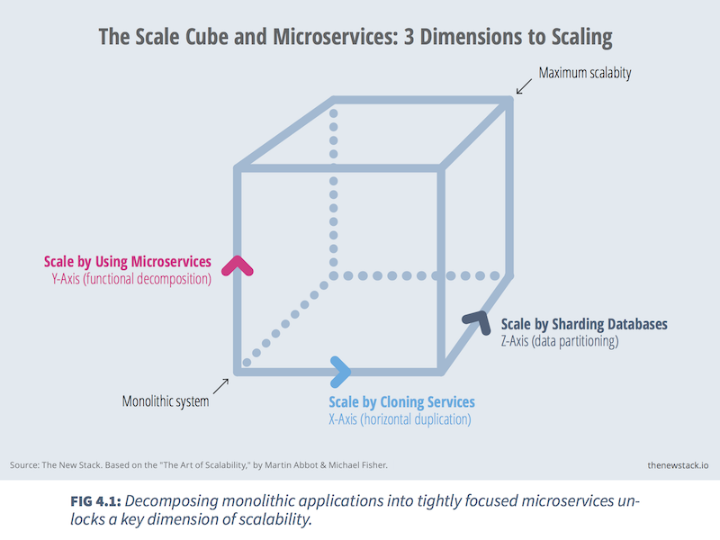
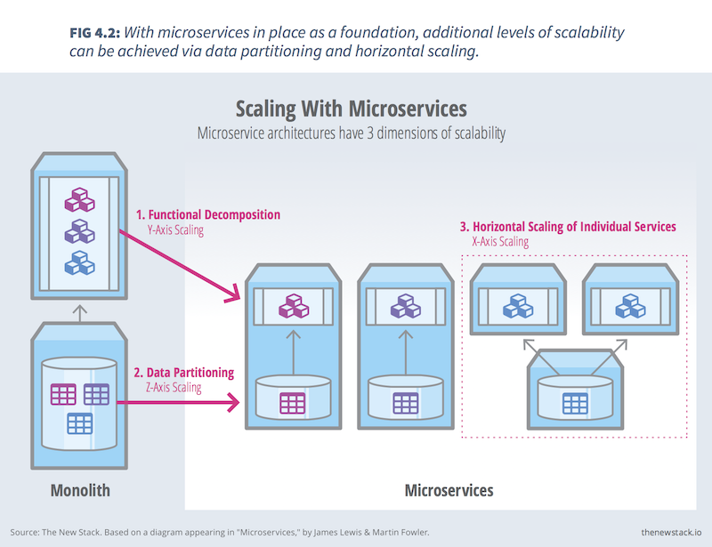

# From Monolith to Microservices
by Vivek Juneja

---

You’re locked in a daily struggle with a large enterprise system that’s been chugging away since the dawn of IT. The development team doesn’t want to get fired, and so is fearful of making changes or adding new code to the monolith.

The most mundane of changes is discussed ad nauseum, in an effort to ensure that the business’ operations are not compromised. New developers spend months learning the system’s codebase before they can even begin to work on it.

When things go wrong, operations blames development and development blames QA. Project managers blame the budget and everyone else. The business loses confidence in IT and begins to look for outsourcers to replace the internal team.

This scenario — immortalized in the DevOps novel “[The Phoenix Project](http://itrevolution.com/books/phoenix-project-devops-book/)” —  is faced every day by enterprise IT practitioners.

Unless you’ve been living under a rock, you’ve heard of how microservices can turn this scenario on its head, enabling a new, more agile world in which developers and operations teams work hand in hand to deliver small, loosely coupled bundles of software quickly and safely. Microservices-based architectures, rather than being something wholly new, are based on the software development and delivery practices of modern web-scale companies like Google, Amazon, Netflix and Twitter. However, the [plateau of productivity ](https://en.wikipedia.org/wiki/Hype_cycle)with this technology is far, far away — at least for most main street enterprises.

For those new to microservices, there are plenty of resources and war stories on the Web about how companies have embraced the approach over time. Most of this information is scattered across blog posts, lectures and seminars, however, making it difficult to make sense of the big picture.

While a one-size-fits-all approach to adopting microservices cannot exist, it is helpful to examine the base principles that have guided successful adoption efforts.

## Adopting Microservices
One common approach for teams adopting microservices is to identify existing functionality in the monolith that is both non-critical and fairly loosely coupled with the rest of the application. For example, in an e-commerce system, events and promotions are often ideal candidates for a microservices proof-of-concept. Alternately, more sophisticated teams can simply mandate that all new functionality must be developed as a microservice.

In each of these scenarios, the key challenge is to design and develop the integration between the existing monolith and the new microservices. When a part of the monolith is re-designed using microservices, a common practice is to introduce glue code to help it to talk to the new services.

Michael Feathers, in the book “Working Effectively With Legacy Code,” introduced the concept of [seams](http://www.informit.com/articles/article.aspx?p=359417&seqNum=2). A seam is a place where the program’s behavior can be altered without editing. Using the concept of a seam, we can identify places in the monolith where a change can be introduced that will help it to interact with the new microservices.

Building a feature proxy that “fools” the monolith and instead calls the new microservices is another possible approach. An API[ gateway](http://thenewstack.io/?s=api+gateway) can help combine many individual service calls into one coarse-grained service, and in so doing reduce the cost of integrating with the monolith.

The main idea is to slowly replace functionality in the monolith with microservices, while minimizing the changes that must be added to the monolith to support this transition. This is important in order to reduce the cost of maintaining the monolith and minimize the impact of the migration.

## Microservices Architectural Patterns
A number of architectural patterns exist that can be leveraged to build a solid microservices implementation strategy. I will present some common ones that may be evaluated for your own projects.

In their book “[The Art of Scalability](http://theartofscalability.com/),” Martin Abbott and Michael Fisher elaborated on the concept of the “[scale cube](http://microservices.io/articles/scalecube.html),” illustrating various ways to achieve scalability in a software system. The microservices pattern maps to the Y-axis of the cube, wherein functional decomposition is used to scale the system. Each service can then be further scaled by cloning (X-axis) or sharding (Z-axis).

Alistair Cockburn introduced the “ports and adapters” pattern, also called [hexagonal architecture](http://alistair.cockburn.us/Hexagonal+architecture), in the context of building applications that can be tested in isolation. However, it has been increasingly used for building reusable microservices-based systems, [as advocated by](https://skillsmatter.com/skillscasts/5280-hexagonal-microservices) James Gardner and Vlad Mettler. A hexagonal architecture is an implementation of a pattern called [bounded context](http://martinfowler.com/bliki/BoundedContext.html), wherein the capabilities related to a specific business domain are insulated from any outside changes or effects.

Examples abound of these principles being put to practice by enterprises migrating to microservices. Click Travel open sourced their [Cheddar framework](https://github.com/ClickTravel/Cheddar), which captures these ideas in an easy-to-use project template for Java developers building applications for Amazon Web Services. SoundCloud, after a failed attempt at a big-bang refactoring of their application, [based their microservices migration](http://www.infoq.com/news/2014/06/soundcloud-microservices) on the use of the bounded context pattern to identify cohesive feature sets which did not couple with the rest of domain.

One challenge faced by teams new to microservices is dealing with distributed transactions spanning multiple independent services. In a monolith this is easy, since state changes are typically persisted to a common data model shared by all parts of the application. This is not the case, however, with microservices.

Having each microservice managing its own state and data introduces architectural and operational complexity when handling distributed transactions. Good design practices, such as domain-driven design, help mitigate some of this complexity by inherently limiting shared state.

Event-oriented patterns such as [event sourcing](http://martinfowler.com/eaaDev/EventSourcing.html) or command query responsibility segregation ([CQRS](http://martinfowler.com/bliki/CQRS.html)) can help teams ensure data consistency in a distributed microservices environment. With event sourcing and CQRS, the state changes needed to support distributed transactions can be propagated as events (event sourcing) or commands (CQRS). Each microservice that participates in a given transaction can then subscribe to the appropriate event.

This pattern can be extended to support [compensating](https://en.wikipedia.org/wiki/Compensating_transaction) operations by the microservice when dealing with eventual consistency. Chris Richardson [presented an implementation of this](http://www.slideshare.net/chris.e.richardson/building-and-deploying-microservices-with-event-sourcing-cqrs-and-docker-hacksummit-2014) in his talk at hack.summit() 2014 and shared example code [via Github](https://github.com/cer/event-sourcing-examples). Also worth exploring is Fred George’s [notion of ‘streams and rapids,’](https://vimeo.com/79866979) which uses asynchronous services and a high speed messaging bus to connect the microservices in an application.

While architectures such as these are promising, it is important to remember that, during the transition from monolith to a collection of microservices, both systems will exist in parallel. To reduce the development and operational costs of the migration, the architectural and integration patterns employed by the microservices must be appropriate to the monolith’s architecture.

## Architectural & Implementation Considerations

### Domain Modeling
Domain modeling is at the heart of designing coherent and loosely coupled microservices. The goal is to ensure that each of your application’s microservices are adequately isolated from runtime side effects of, and insulated from changes in the implementation of, the other microservices in the system.

Isolating and insulating microservices also helps ensure their reusability. For example, consider a promotions service that can be extracted from a monolithic e-commerce system. This service could be used by various consuming clients using mobile web, iOS or Android apps. In order for this to work predictably, the domain of “promotions,” including its state entities and logic, needs to be insulated from other domains in the system, like “products,” “customers,” “orders,” etc. This means the promotions service must not be polluted with cross-domain logic or entities.

Proper domain modeling also helps avoid the pitfall of modeling the system along technological or organizational boundaries, resulting in data services, business logic and presentation logic each implemented as separate services.

>All roads to microservices pass through domain modeling.

Sam Newman discusses these principles in his book “[Building Microservices](http://info.thoughtworks.com/building-microservices-book).” Vaughn Vernon focuses on this area even more deeply  in “[Implementing Domain-Driven Design](https://vaughnvernon.co/?page_id=168).”

### Service Size
Service size is a widely debated and confusing topic in the microservices community. The overarching goal when determining the right size for a microservice is to not make a monolith out of it.

The “[Single Responsibility Principle](http://www.objectmentor.com/resources/articles/srp.pdf)” is a driving force when considering the right service size in a microservices system. Some practitioners advocate as small a service size as possible for independent operation and testing. Building microservices in the spirit of [Unix](http://www.infoq.com/presentations/Micro-Services) utilities also leads to small codebases which are easy to maintain and upgrade.

Architects must be particularly careful in architecting large domains, like “products” in an e-commerce system, as these are potential monoliths, prone to large variations in their definition. There could be various types of products, for example. For each type of product, there could be different business logic. Encapsulating all this can become overwhelming, but the way to approach it is to put more boundaries inside the product domain and create further services.

Another consideration is the idea of replaceability. If the time it takes to replace a particular microservice with a new implementation or technology is too long (relative to the cycle time of the project), then it’s definitely a service that needs further reworking of its size.

### Testing
Let’s look at some operational aspects of having the monolith progressively transformed into a microservices-based system. Testability is a common issue: During the course of developing the microservices, teams will need to perform integration testing of the services with the monolith. The idea, of course, is to ensure that the business operations spanning the pre-existing monolith and the new microservices do not fail.

One option here is to have the monolith provide some consumer-driven contracts that can be translated into test cases for the new microservices. This approach helps ensure that the microservice always has access to the expectations of the monolith in the form of automated tests. The monolith’s developers would provide a spec containing sample monolith requests and expected microservice responses. This spec is then used to create relevant mocks at the monolith end, and as the basis for an automated test suite that is run before integrating the microservices with the monolith. [Pact](https://github.com/DiUS/pact-jvm), a consumer-driven contract testing library, is a good reference for this approach.

Creating a reusable test environment that can deploy a test copy of the entire monolith — and making it available, on-demand, to the microservices teams — is also useful. This eliminates potential roadblocks for those teams and improves the feedback loop for the project as a whole. A common way of accomplishing this is to containerize the entire monolith in the form of Docker containers orchestrated through an automation tool like [Docker Compose](https://docs.docker.com/compose/). This deploys a test infrastructure of the monolith quickly and gives the team the ability to perform integration tests locally.

### Service Discovery
A service may need to know about other services when accomplishing a business function. A [service discovery](http://en.wikipedia.org/wiki/Service_discovery) system enables this, wherein each service refers to an external registry holding the endpoints of the other services. This can be implemented through environment variables when dealing with a small number of services; [etcd](http://thenewstack.io/about-etcd-the-distributed-key-value-store-used-for-kubernetes-googles-cluster-container-manager/), [Consul](https://www.consul.io/) and [Apache Zookeeper](https://zookeeper.apache.org/) are examples of more sophisticated systems commonly used for service discovery.

### Deployment
Each microservice should be self-deployable, either on a runtime container or by embedding a container in itself. For example, a JVM-based microservice could embed a [Tomcat container](https://en.wikipedia.org/wiki/Apache_Tomcat) in itself, reducing the need for a standalone web application server.

At any point in time, there could be a number of microservices of the same type (i.e., X-axis scaling as per[ the](https://devcentral.f5.com/Portals/0/Users/038/38/38/x-axis-scaling.png) scale cube) to allow for more reliable handling of requests. Most implementations also include a software load balancer that can also act as a service registry, such as [Netflix Eureka](https://github.com/Netflix/eureka/wiki/Eureka-at-a-glance). This implementation allows for failover and transparent balancing of requests as well.

### Build and Release Pipeline
Additional considerations when implementing microservices are quite common, such as having a continuous integration and deployment pipeline. The notable caveat for this in a microservices-based system is having an on-demand, exclusive, build and release pipeline for each microservice. This reduces the cost of building and releasing the application as a whole. We do not need to build the monolith when a microservice gets updated. Instead, we only build the changed microservice and release it to the end system.

Release practices also need to include the concept of [rolling upgrades](http://docs.ansible.com/guide_rolling_upgrade.html) or [blue-green deployment](http://martinfowler.com/bliki/BlueGreenDeployment.html). This means that, at any point of time in a new build and release cycle, there can be concurrent versions of the same microservice running in the production environment. A percentage of the active user load can be routed to the new microservice version to test its operation, before slowly phasing out the old version. This helps to ensure that a failed change in a microservice does not cripple the monolith. In case of failure, the active load can be routed back to the old version of the same service.

### Feature Flags
One other common pattern is to allow for [feature flags](http://en.wikipedia.org/wiki/Feature_toggle). A feature flag, like a configuration parameter, can be added to the monolith to allow toggling a feature on or off. Implementing this pattern in the monolith would allow us to trigger the use of the relevant microservice for the feature when the flag is turned on. This enables easy A/B testing of features migrated from the monolith to microservices. If the monolith version of a feature and the new microservice replicating the said feature can co-exist in the production environment, a traffic routing implementation along with the feature flag can help the delivery teams more rapidly build the end system.

## Developer Productivity During Microservices Adoption

Monolithic architectures are attractive in that they allow quick turnaround of new business features on a tight schedule — when the overall system is still small. However, this becomes a development and operations nightmare as the system grows up.

>If working with your monolith was always as painful as it is now, you probably wouldn’t have it. Rather, systems become monoliths because adding onto the monolith is easy at first.

Giving power to developers to choose a “microservices first” approach when building a new feature or system is complicated and has many moving parts. Doing so demands strong disciplines around architecture and automation, which in turn helps create an environment that allows teams to quickly and cleanly build microservices.

One approach to building out this developer infrastructure is to create a standard boilerplate project that encapsulates key principles of microservice design, including project structure; test automation; integration with instrumentation and monitoring infrastructures; patterns, like circuit breakers and timeouts; API frameworks; and documentation hooks, among others.

Project templates allow teams to focus less on scaffolding and glue code, and more on building business functionality in a distributed microservices-based environment. Projects like [Dropwizard](http://www.dropwizard.io/), [Spring Boot](https://github.com/spring-projects/spring-boot), Netflix [Karyon](https://github.com/Netflix/karyon) are interesting approaches to solving this. Making the right choice between them depends on the architecture and developer skill level.

## Monitoring and Operations
Co-existing monoliths and microservices require a comprehensive monitoring of performance, systems and resources. This is more pronounced if a particular feature from the monolith is replicated through a microservice. Collecting statistics for performance and load will allow the monolithic implementation and the microservices-based one replacing it to be compared. This will enable better visibility into the gains that the new implementation brings to the system, and improve confidence in pursuing further migration.

## Organizational Considerations
The most challenging aspects of moving from monoliths to microservices are the organizational changes required, such as building services teams that own all aspects of their microservices. This requires creating multi-disciplinary units which include developers, testers and operations staff, among others. The idea is to embrace more collective code ownership and care for software craftsmanship.

Most of the ideas shared in this article have either been practiced or have delivered results in organizations of all sizes. However, this is not a one-size-fits-all paradigm. Hence, it's important to keep an eye on evolving patterns and adoption war stories. As more organizations move from monoliths to microservices, we will have more to learn along our journey.

---
Copyright &copy; 2015, The New Stack. All rights reserved.